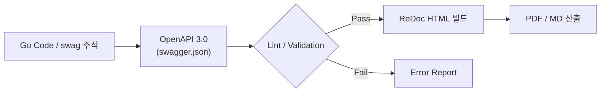

# [기술 표준] 📄📌 API 정의서 자동 산출 가이드 - Swagger(OpenAPI) + Redocly 기반

## **1. 문서 목적**

본 문서는 Go 서버 소스 코드를 **단일 진실 공급원(SSOT)**으로 삼아, API 명세 작성부터 최종 산출물(HTML/PDF) 생성까지의 과정을 표준화한다.

- **신뢰성:** 코드와 문서 간의 데이터 불일치(Drift) 원천 차단
    
- **효율성:** 문서 작성을 위한 중복 수기 작업 제거
    
- **품질:** Lint를 통한 정량적 명세 품질 강제
    

---

## **2. 핵심 개념 (Core Principles)**

- **Code-first:** 모든 API 명세는 Go 코드 내 주석(`swag`)으로 관리한다.
    
- **Automation:** `make swagger` 한 번으로 스펙 생성부터 PDF 변환까지 자동 실행한다.
    
- **Strictness:** 성공/실패 응답 및 `example`이 누락된 경우 빌드 실패로 간주한다.
    

---

## **3. 전체 흐름도 (Workflow)**

코드 스니펫



---

## **4. 사전 준비물 (Prerequisites)**

- **Go & swag:** API 스펙 추출 도구
    
- **Node.js & @redocly/cli:** 스펙 검증 및 HTML 빌드 도구
    
- **Playwright:** HTML의 레이아웃 무결성을 유지한 채 PDF로 변환하는 엔진
    

---

## **5. 스펙 작성 원칙 (Engineering Standard) - 필독**

이 섹션은 문서의 품질을 결정하는 가장 중요한 규칙이다.

### **5.1 성공 / 실패 응답의 구체적 명시**

모든 API는 **성공(2xx) + 주요 실패(4xx/5xx)** 응답을 명시해야 한다. 특히 `example` 키워드를 사용하여 클라이언트 개발자가 Mock 데이터로 즉시 활용할 수 있게 한다.

> **작성 예시 (주석)**

Go

```
// @Summary 사용자 조회
// @Description 사용자 ID를 기반으로 상세 정보를 조회한다.
// @Accept  json
// @Produce  json
// @Param   id   path      int  true  "사용자 식별자"
// @Success 200 {object} dto.UserResponse example({"id":1,"name":"kim","email":"dev@example.com"})
// @Failure 400 {object} error.BadRequest example({"code":"INVALID_PARAM","message":"잘못된 요청 파라미터입니다."})
// @Failure 401 {object} error.Unauthorized example({"code":"UNAUTHORIZED","message":"인증 토큰이 유효하지 않습니다."})
// @Failure 500 {object} error.Internal example({"code":"SERVER_ERROR","message":"시스템 내부 오류"})
// @Router /api/v1/users/{id} [get]
```

### **5.2 공통 에러 모델 정의**

중복을 방지하고 규격화된 에러 처리를 위해 공통 에러 스키마를 사용한다.

- **필수 필드:** `code` (비즈니스 에러 코드), `message` (에러 상세 설명)
    
- **참조 방식:** `components/schemas/Error`로 정의 후 모든 API에서 `$ref` 형태로 활용 권장.
    

---

## **6. 단계별 실행 절차 (Execution)**

### **Step 1: OpenAPI 스펙 생성**

Bash

```
# 코드 주석으로부터 swagger.json / yaml 추출
make swagger
```

### **Step 2: 품질 검증 (Lint)**

Bash

```
# 필수 항목(summary, description, example) 누락 여부 체크
npx @redocly/cli lint server/docs/swagger.json
```

### **Step 3: HTML API 정의서 생성 (ReDoc)**

Bash

```
npx @redocly/cli build-docs server/docs/swagger.json \
  --options.expandResponses="200,400,401,500" \
  --options.requiredPropsFirst=true \
  --options.pathInMiddlePanel \
  -o dist/api-docs.html
```

### **Step 4: PDF 자동 변환**

Bash

```
# Playwright를 이용하여 HTML과 100% 동일한 PDF 산출
node scripts/html-to-pdf.js
```

---

## **7. 운영 및 관리 정책**

1. **Direct Edit Prohibited:** 산출물(HTML/PDF)을 직접 수정하는 행위는 절대 금지한다. 모든 수정은 오직 **Go 코드 주석**에서만 수행한다.
    
2. **CI/CD 연동:** 모든 PR(Pull Request) 시 Lint 검사를 통과해야 하며, 배포 시점에 PDF를 자동 생성하여 아카이빙한다.
    
3. **버전 명시:** 최종 산출물 파일명에는 반드시 `[API_정의서]_[버전]_[커밋해시].pdf`를 포함한다.
    

---

## **8. 기대 효과**

- **신뢰성:** 개발자가 명세 수정을 잊더라도 코드가 변경되면 문서가 강제로 갱신됨.
    
- **커뮤니케이션:** 프론트엔드/QA 팀에게 항상 최신화된 예제 데이터를 제공.
    
- **정체성:** 단순한 텍스트 문서가 아닌 '동작하는 명세'로서의 가치 확보.
    

---

