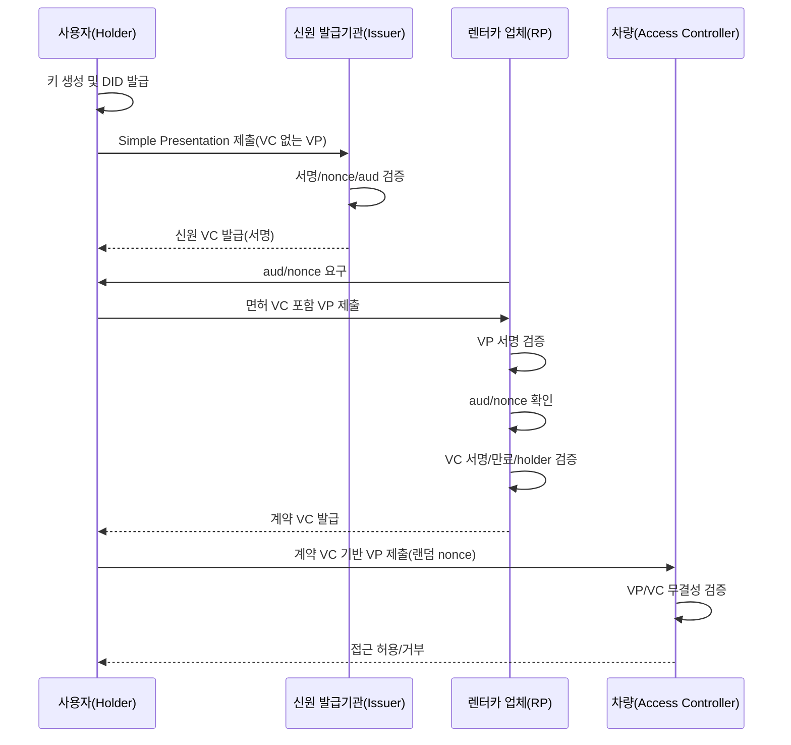
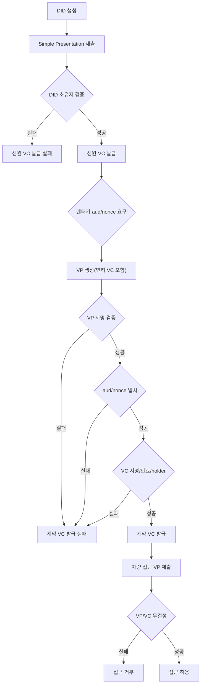

# 데모 시퀀스 정의 및 설계

> 슬라이드용 텍스트 구조안 (데모 시퀀스 정의/설계)

---

## 시퀀스 (전체 흐름)

## 검증 체크포인트

## 0. 슬라이드 목적
- 교육용 데모 시퀀스를 **단계/역할/검증 포인트** 중심으로 설명한다.
- “왜 이 순서로 진행하는지”와 “실패 케이스가 왜 중요한지”를 전달한다.

## 1. 데모 주체(Actors)
- 사용자(Holder)
- 신원 발급기관(Issuer, 예: 면허증 발급부서)
- 렌터카 업체(Rental RP)
- 차량(Access Controller)

## 2. 시퀀스 개요(한 줄 요약)
1) DID 생성 → 2) 신원 VC 발급(Simple Presentation 검증) → 3) 계약 VC 발급(VP 검증) → 4) 차량 접근 제어(VP 검증)

## 3. 단계별 시퀀스 (핵심 메시지)
### 3.1 DID 생성
- 사용자 키 생성 및 DID 발급
- 이후 모든 VC/VP의 **서명 주체(Holder)** 로 사용

### 3.2 신원 VC 발급 (기관)
- 사용자: **Simple Presentation** 제출(VC 없는 VP)
- 기관: 서명/nonce/aud 검증 → **사용자 DID 소유 확인**
- 결과: 기관 DID로 서명된 **신원 VC 발급**

### 3.3 렌터카 계약 VC 발급 (민간)
- 렌터카 업체: **aud + nonce** 요구
- 사용자: 면허 VC 포함 VP 생성 후 제출
- 렌터카 업체 검증 순서:
  1) VP 서명 무결성
  2) aud/nonce 일치
  3) VP 포함 VC 서명 무결성
  4) VC 만료 여부
  5) VC holder DID = VP 서명 DID 일치
- 결과: 계약 VC 발급

### 3.4 차량 접근 제어
- 사용자: 계약 VC 기반 VP 제출(랜덤 nonce 포함)
- 차량: VP/VC 무결성 및 만료 검증
- 결과: 접근 허용/거부

## 4. 시나리오 실패 케이스(데모 포인트)
- DID 미발급 상태에서 신원 VC 요청 → 실패
- 신원 VC 만료 후 계약 시도 → 실패
- DID 재생성 후 기존 VC로 VP 제출 → **holder 불일치로 실패**
- 계약 VC 만료 후 차량 접근 시도 → 실패

## 5. 데모 채널(실행 방식)
- **gRPC 데모**: demo-client / demo-issuer / demo-rp
- **REST 데모**: did_service_endpoint
- **Android 데모 앱**: JNI + REST

## 6. 시퀀스 검증 체크리스트(UX 표시)
- 신원 VC 발급 단계
  - [ ] DID 인증 유효
  - [ ] VC 생성 발급
- 계약 VC 발급 단계
  - [ ] VP 서명 검증 유효
  - [ ] VP aud/nonce 확인
  - [ ] VC 무결성(서명/만료/holder) 확인
- 차량 접근 단계
  - [ ] VP 무결성 체크 완료

## 7. 운영 팁(강의 흐름)
- “정상 흐름” 1회 완주 후, **실패 케이스**를 의도적으로 재현
- 만료 시간(초 단위)을 짧게 설정해 교육 흐름을 빠르게 전환

## 8. 참조 문서
- `docs/0-2.교육-용어-시나리오-정리.md`
- `docs/2-2.실습-체크리스트.md`
- `docs/1-3.아키텍처.md`
